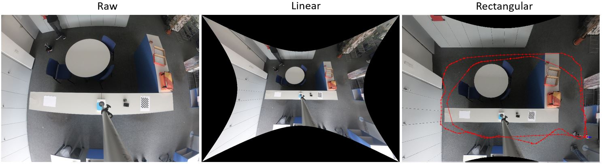
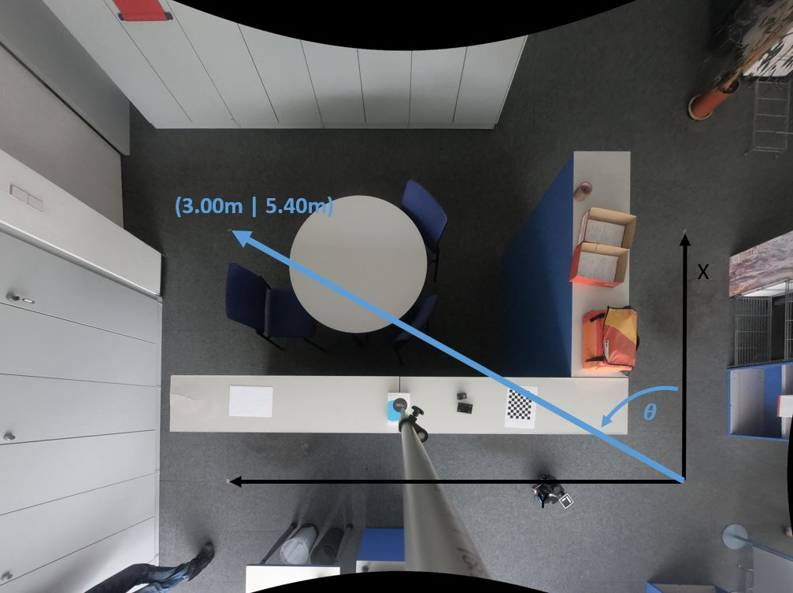

# Ground truth

The ground truth was captured via a GoPro, by tracking an ArUco marker's pose (Original ArUco, id=1, 100mm).

 </br>
Video: [assets/slammy_ground_truth_two_loops.avi](assets/slammy_ground_truth_two_loops.avi)

# Calibrated images
The calibrated images are in [image_seq_linear_rectangle](image_seq_linear_rectangle)



Calibration workflow: <br>
Raw -> Linear (via fis eye calibration) <br>
Linear -> Rectangular (via homography and known ground points).

# Transformation from pixel to world
The transformation of pixel coordinate `x = [x_pix y_pix]` to a world coordinate `X = [x_world y_world]` can be done by: `X=R*x+t` with:
```
R =
  -1.1096e-06    -0.001002
  -0.00099834  -4.9957e-06
```
and
```
t =
       5.0288       7.4108
```
Note: Due to the homography, this transformation is only valid for objects with Z=0.4m. This is equal to height of the ArUco marker in all images.
# Path
The file [slammy_ground_truth_two_loops.txt](slammy_ground_truth_two_loops.txt) contains the path world and pixel coordinates, along with the estimated pose and the image.
```
X[m],Y[m],Heading [deg],Time,piX,piY,Path_to_Image
0.005,-0.003,7.2,16-Jul-2021 15:30:51,7402,5006,G0019266_linear_linear_rectangle.jpg
0.004,-0.003,5.9,16-Jul-2021 15:30:51,7401,5006,G0019267_linear_linear_rectangle.jpg
0.005,-0.003,7.2,16-Jul-2021 15:30:52,7402,5006,G0019268_linear_linear_rectangle.jpg
0.005,-0.003,6.5,16-Jul-2021 15:30:52,7401,5006,G0019269_linear_linear_rectangle.jpg
0.004,-0.004,6.6,16-Jul-2021 15:30:53,7402,5006,G0019270_linear_linear_rectangle.jpg
0.005,-0.003,7.7,16-Jul-2021 15:30:54,7402,5006,G0019271_linear_linear_rectangle.jpg
0.004,-0.003,6.6,16-Jul-2021 15:30:54,7402,5006,G0019272_linear_linear_rectangle.jpg
0.005,-0.003,7.8,16-Jul-2021 15:30:54,7401,5006,G0019273_linear_linear_rectangle.jpg
...
```

# Coordinate System
The coordinate system is defined as follows:<br>

