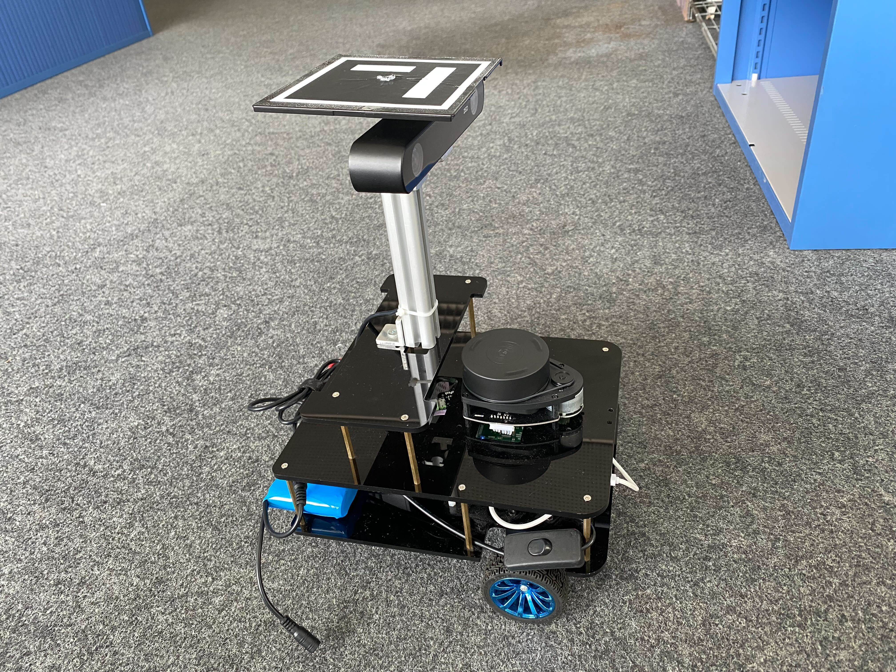

# slammy repository

This repository contains stuffs for the slam course at the University of Stuttgart. Overall the "Slammy" robot (See its portrait above)
can be regarded as an "integrated" system/platform but at the same time it is organised modularly. By the functionality, we have for now three sub-systems
i.e:

- Rikirobot with Lidar: the central part, as it controls the movement of the platform. Connected parts are a Rasperry Pi with Ubuntu 16.04
and a RPLidar A1 Lidar sensor ([Link](https://www.slamtec.com/en/Lidar/A1)).
- Vision part: the vision sub-system, supplied by a separate battery. Hardwares are a [Jetson Xavier NX](https://developer.nvidia.com/embedded/jetson-xavier-nx-devkit)
provides computing power and a [Zed2 camera](https://www.stereolabs.com/zed-2/).
- Gopro for a birdview groundtruth: a Gopro is mounted on the roof of the room, so while recording, it captures the robot route by tracking the ArUco marker which put on the top of the Slammy

Note currently the three sub-systems are temporarily crafted together so they are not yet deeply coupled. But it already fullfills the current requirements, i.e. recording multi-modal data for the course usage.
As a future work, we might put more effort to develop it into a real integrated smart agent 😊

## Rikitrobot with lidar
More details see [Readme.md](Rikirobot/README.md)

Details about the rover such as:
* How to get started with the rover
* How to control the rover
* How to record a rosbag (including the "two_loops" rosbag)
* How to play the rosbag in matlab
* Several examples:
 * 2d lidar slam
 * Odometry
 * Inertial navigation data

  

## Vision part
More details see [Readme.md](Vision/README.md)

Details about the stereo camera such as:
* How to get started with the hardware i.e. Jetson Xavier NX board and Zed2 camera
* A rosbag of the "two_loops" run
* How to run mono/binocular ORB slam in Matlab/C++
* How to run direct sparse odometry(DSO) in C++
* Visualisation of stereo color/depth images and its resulted point cloud
* Volumetric dense mapping with [Voxblox](https://github.com/ethz-asl/voxblox) based on a pre-estimated trajectory by ORB-SLAM3
* How to extract SuperPoint features and run SuperGlue to match them between image pairs

Raw Stereo:  

Orb slam:  
  

## Ground truth
More details see [Readme.md](Groundtruth/README.md)

The ground truth was captured via a GoPro, by tracking an ArUco marker's pose.

  
Video: [Groundtruth/assets/slammy_ground_truth_two_loops.avi](Groundtruth/assets/slammy_ground_truth_two_loops.avi)
