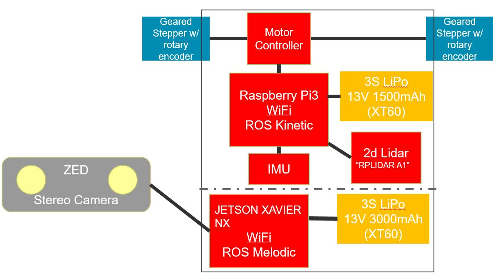

# slammy repository

This repository contains stuffs for the slam course at the University of Stuttgart. Three parts are
currently available:
- Rikirobot + Lidar
- Jetson Xavier NX board + Zed2 camera
- Gopro for a birdview groundtruth

## Rikitrobot + lidar
More details see [Readme.md](Rikirobot/README.md)

## Jetson Xavier NX board + Zed2 camera
More details see [Readme.md](Jetson_NX_Zed2/README.md)

## Groundtruth
More details see [Readme.md](Groundtruth/README.md)

The ground truth was captured via a GoPro, by tracking an ArUco marker's pose.

  
Video: [Groundtruth/assets/slammy_ground_truth_two_loops.avi](Groundtruth/assets/slammy_ground_truth_two_loops.avi)
