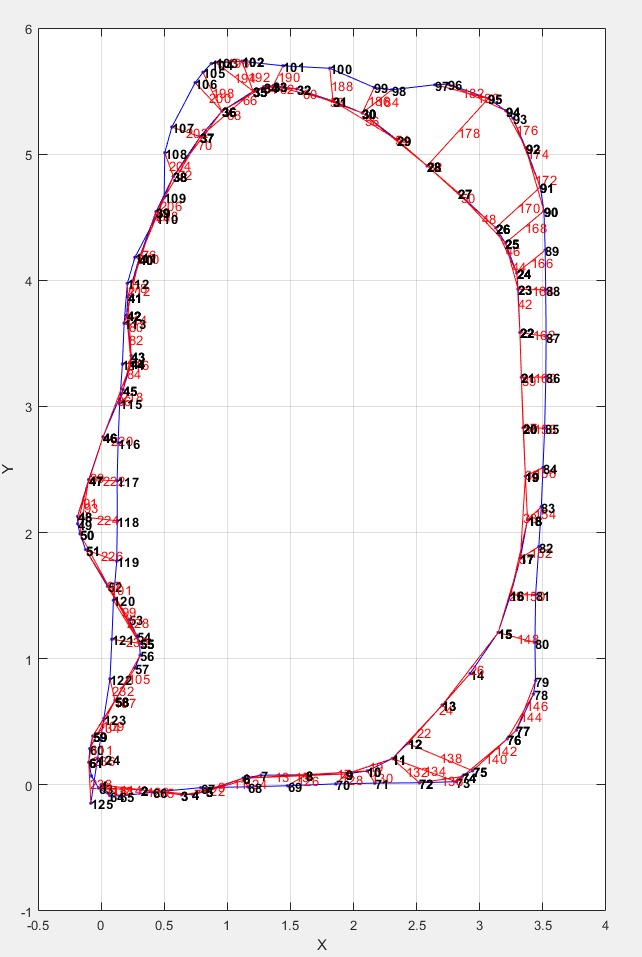
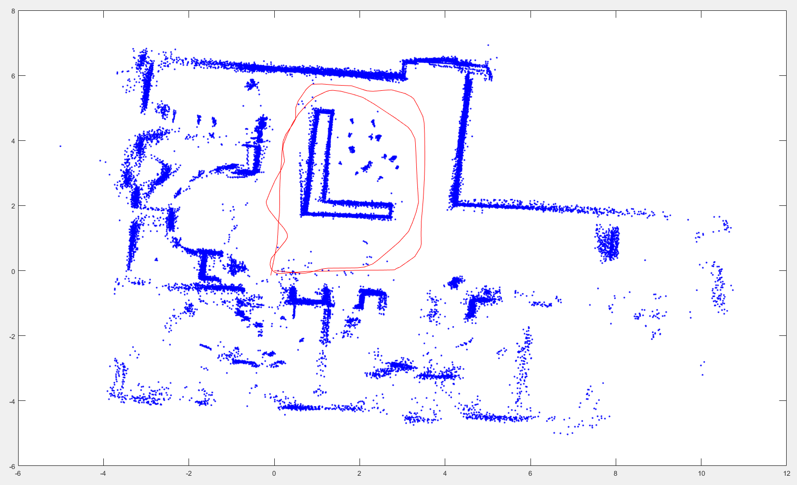

# ICP-based Graph SLAM
The Matlab script contains a simple 2D lidar SLAM algorithm based on the ICP algorithm and a graph SLAM backend.
Possible loop closure candidates are selected based on the distance to the current position and matched using the ICP algorithm.
For the ICP algorithm and the graph SLAM backend, the implementation provided in Matlab is used.
## Solution
### Final Graph:

### Accumulated Pointcloud and Trajectory (red):

