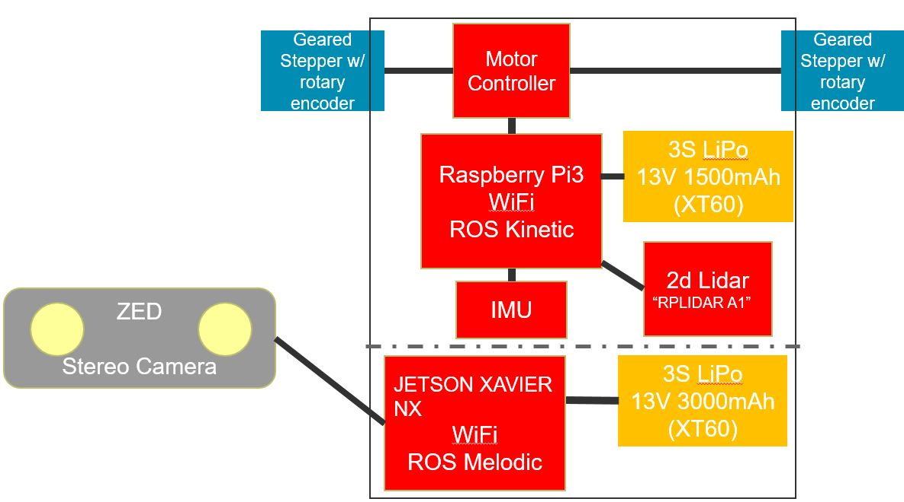
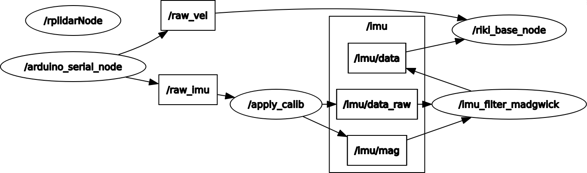

# Rikirobot

For general settings:
https://ubuntu-mate.org/raspberry-pi/

# Hardware


<br>

* raspberry pi 3 - Ubuntu Mate
* RPLIDAR https://www.slamtec.com/en/Lidar/A1
* IMU + magnetometer
* 2 Stepper motors with rotary encoder
* 3S LiPo Battery


## How to connect to riki robot via ssh
`ssh rikirobot@141.58.125.213`

user: `rikirobot`
pw: `123456`

you might need an ip scanner to find the ip.

If you never connected to your local wifi, use hdmi, mouse and keyboard.

## Set up the Lidar, odometry and tele op
`sudo ./Desktop/run_riki.sh`

(sudo to set time).

Content:
````
#!/bin/bash

#start all stuff for rikirobot
#user rikirobot
#pw: 123456
#usual ip 141.58.125.212

#get ntim
sudo date -s "$(wget -qSO- --max-redirect=0 google.com 2>&1 | grep Date: | cut -d' ' -f5-8)Z"


# start lidar
roslaunch rplidar_ros rplidar.launch &

# start car with odometry
roslaunch rikirobot bringup.launch &

# start tele operator (keyboard)
rosrun teleop_twist_keyboard teleop_twist_keyboard.py &
````
## connect to master from extern pc (ubuntu)

Set ip to master
`export ROS_MASTER_URI=http://141.58.125.213:11311`

Set my IP:
`export ROS_IP=`hostname -I`

## List all topics
Show all topics:

`rostopic list`

Show contend of a meassege:

`rostopic echo /scan`

Show rqt_graph:

`rosrun rqt_graph rqt_graph`




## Record a ROS bag
`./records/rosbag_record.sh`

that runs following commands:
````
rosbag record /imu/data /imu/data_raw /imu/mag /imu_filter_madgwick/parameter_descriptions /imu_filter_madgwick/parameter_updates /odom /pid /scan /tf
````

[Rikirobot\rosbag\two_loops_robot\2021-07-16-15-31-07_two_loops_robot.bag](Rikirobot\rosbag\two_loops_robot\2021-07-16-15-31-07_two_loops_robot.bag) Contains the robots sensor data from the "two_loops" run.


## Some use full links

English
https://www.programmersought.com/article/70391490094/

Chinese
https://github.com/ykevin/rikirobot_docs/tree/master/UserManual


## MATLAB examples
Some exemples of how to use the recorded rosbag in Matlab.

### Teleop

[Rikirobot\Matlab\example_teleop](Matlab/example_teleop)

Remote control via numpad for slammy.
Control the robot by publishing ROS messages with the desired linear and angular velocity.

You need the current ip address.

Use the numpad to navigate:

8: Forward

7: Forward and turn left

9: Forward and turn right

4: Sharp left

2: Backwards

6: Sharp right

1: Backwards and turn left

3: Backwards and turn right


### Pure Lida SLAM from rosbag
[Rikirobot\Matlab\example_lidar_slam](Matlab/example_lidar_slam)

Use the MATLAB's `lidarSLAM` to evaluate the recorded ROSbag.

The lidarSLAM class performs simultaneous localization and mapping (SLAM) for lidar scan sensor inputs. The SLAM algorithm takes in lidar scans and attaches them to a node in an underlying pose graph. The algorithm then correlates the scans using scan matching. It also searches for loop closures, where scans overlap previously mapped regions, and optimizes the node poses in the pose graph.


 </br>


### Odometry
[Rikirobot\Matlab\example_odometry](Matlab/example_odometry)

Visualize the topic `\odom`, which, contains the accumulated odometry data.

 </br>


### Inertial navigation
[Rikirobot\Matlab\example_imu](Matlab/example_imu)


madgwick filtered https://nitinjsanket.github.io/tutorials/attitudeest/madgwick imu data is available under the topic `\imu\data`.

The timestamp is expressed as:
* stamp.sec: seconds (stamp_secs) since 01-Jan-1970.
* stamp.nsec: nanoseconds since stamp_secs.


 </br>

### Compare trajectories to ground truth
[Rikirobot\Matlab\example_compare_trajectories](Matlab/example_compare_trajectories)


 </br>
