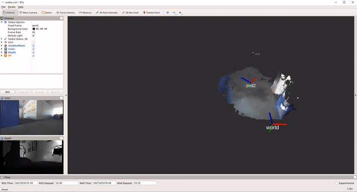

## Demo videos
- ORB-SLAM3: feature based (indirect) method for simultaneous mapping and localization, thanks to the loop closure and global pose optimisation (Bundle Adjustment) it can keep the two loops aligned together [YouTube Link](https://www.youtube.com/watch?v=22eoGMiPCzw)  
  
- Stereo Direct Sparse Odometry (Stereo-DSO): photometric based direct method, although no loop closure and global optimisation - strictly speaking an odometry method - it still produces a reasonable result while much denser map compared with ORB-SLAM result [YouTube Link](https://www.youtube.com/watch?v=4iUn-hC-BH4)  
  
- Depth map and point cloud: the depth map is computed based on the stereo image caputured by the Zed2 stereo camera. With the camera intrinsic parameter, the pixels are re-projected to 3D space to obtain a 3D point cloud. From the visualisation of point cloud, the cluttering and temperal inconsistency can be observed. How to fuse the noisy depth map sequence is a challenging task  [YouTube Link](https://www.youtube.com/watch?v=XDazW9k8EKY)  
  
- Volumetric dense mapping: TSDF based volumetric dense mapping is a de-facto standard for fusing depth maps with known camera poses. Here we choose to use the camera poses estimated by ORB-SLAM3 as it has the better global consistency thanks to global optimisation. [YouTube Link](https://www.youtube.com/watch?v=gmNJbwXqh7E)  
  

## How to set up Jetson NX board
- Flash SD card & first boot configuration e.g. create account
  - Follow https://developer.nvidia.com/embedded/learn/get-started-jetson-xavier-nx-devkit
  - User: `jetson`; PW: `jetson`
  - `ssh jetson@141.58.125.203`

- Install zsh & oh-my-zsh
  - Follow https://github.com/ohmyzsh/ohmyzsh/wiki (Optional)

- Install ROS melodic
  - Follow http://wiki.ros.org/melodic/Installation/Ubuntu
  - Note `sudo apt install python-rosdep` is needed for rosdep install
  - `sudo apt install python-catkin-tools` needed for advanced catkin commands
  - remember to add `source /opt/ros/melodic/setup.sh` to ~/.bashrc and ~/.zshrc depending on which shell you prefer to use

## How to install Zed2 camera driver and its toolbox
- Install ZED SDK
  - Follow https://www.stereolabs.com/developers/release/
  - Note: `sudo apt update` is needed before executing the install script
  - Executables will be added under `/usr/local/bin` and so directly executable

- Install zed-ros-wrapper& zed-ros-examples
  - Link: https://github.com/stereolabs/zed-ros-wrapper
  - Link: https://github.com/stereolabs/zed-ros-examples
  - Note: as they are ros packages and needs to be cloned to catkin directory named `src`, e.g. `~/Softwares/src`
  - Compile with `catkin build`
  - Make sure the Zed2 camera is connected and start wrapper node with `roslaunch zed_wrapper zed2.launch` (launch `roscore` if needed)

- Visualization in rviz
  - Command `roslaunch zed_display display_zed2.launch`

## How to record rosbag file
- Terminal 1: launch the zed2 driver with `roslaunch zed_wrapper zed2.launch`
- Terminal 2: start the recording with `sudo ./data/record.sh`(sudo for correcting the system date)
- The rosbag and the two image sequences of the stereo cameras from the "two_loops" run can be downloaded from here: \
  https://webdav.ifp.uni-stuttgart.de/s/SycT9Ya96ikBHsS
- A full list of rosbag topics is as shown below: \

## How to visualize pointcloud from depth map
- The depth map with topic name `/zed2/zed_node/depth/depth_registered` and topic type `sensor_msgs/Image` are ready to be visualized as 3D point cloud using the built-in Rviz display plug-in `DepthCloud`
- To let the plug-in find the right message, it is required to set the field `Depth Map Topic` and `Color Image Topic`, an example rviz config can be found [here](configs\depth_map_zed2.rviz)
- Additionally the depth map is accompanied by confidence map which can be also visualized using image display plug-in
- More info see [DepthCloud](https://www.stereolabs.com/docs/ros/depth-sensing/#depth-cloud)

## How to run ORB-SLAM3
- Configure ORB-slam3
  - Link: `https://github.com/UZ-SLAMLab/ORB_SLAM3.git`
  - Clone to `~/Software/projects/ORB_SLAM3`
  - Follow https://github.com/UZ-SLAMLab/ORB_SLAM3#6-ros-examples to build the ROS node
  - Resolve compile error due to the old opencv version used by ros-melodic https://github.com/UZ-SLAMLab/ORB_SLAM3/issues/300
  - Recommand to limit the number of threads in build.sh to avoid system freezes (e.g. make -j3)

- Adapt camera parameter for Zed2 camera
  - Look up the parameters from `rostopic echo /zed2/zed_node/rgb/camera_info`
  - Note the topic name of the image message also needs to be adapted in the source code.
  - An example can be found in `configs/orb-slam3`

- Run ORB-SLAM3 with Zed images
  - Online with images streamed from ros topics
    - One terminal for zed driver `roslaunch zed_wrapper zed2.launch`
    - Other one for ORB-slam and switch to directory `cd Software/projects/ORB_SLAM3`
    - `rosrun ORB_SLAM3 Mono Vocabulary/ORBvoc.txt Examples/Monocular/Zed2.yaml` (Monocular setting)
    - `rosrun ORB_SLAM3 Stereo Vocabulary/ORBvoc.txt Examples/Stereo/Zed2.yaml 0` (Stereo setting)

  - Offline with a recorded rosbag
    - Play a pre-recorded rosbag containing the Zed images `rosbag play 2021-xx-xxxx.bag /zed/left/image_raw:=/camera/image_raw`
    - Switch to directory `cd Software/projects/ORB_SLAM3`
    - `rosrun ORB_SLAM3 Mono Vocabulary/ORBvoc.txt Examples/Monocular/Zed2.yaml` (Monocular setting)
    - `rosrun ORB_SLAM3 Stereo Vocabulary/ORBvoc.txt Examples/Stereo/Zed2.yaml 0` (Stereo setting)

## How to run DSO
- Clone and build DSO project
  - Link: `https://github.com/JakobEngel/dso.git`
  - Clone to `~/Software/projects/dso` and follow the project instruction to build the project

- Build DSO ROS wrapper
  - Link: `https://github.com/BlueWhaleRobot/dso_ros`
  - Clone to catkin workspace `~/Software/src/dso_ros`
  - Set the DSO_PATH before the build by `export DSO_PATH=/home/jetson/Software/projects/dso`
  - Note this ROS wrapper project contains some bugfixes therefore we choose this over the original one

- Run DSO offline
  - Play a pre-recorded rosbag containing the Zed images `rosbag play 2021-xx-xxxx.bag`
  - `rosrun dso_ros dso_live image:=/zed2/zed_node/rgb/image_rect_gray calib=/home/jetson/Software/src/dso_ros/zed2.txt mode=1`

## How to run Stereo-DSO
- Clone and build Stereo-DSO project
  - Link: `https://github.com/HorizonAD/stereo_dso`
  - Clone to `~/Software/projects/stereo_dso` and follow the project instruction to build the project
- Build Stereo-DSO ROS wrapper
  - Link: `https://github.com/LinHuican/stereo_dso_ros`
  - Clone to catkin workspace `~/Software/src/stereo_dso_ros`
  - Adjust the STEREO_DSO_PATH in `CMakeLists.txt` by `set(STEREO_DSO_PATH /home/jetson/Software/projects/stereo_dso)`
  - Note: it is found the parameter `setting_kfGlobalWeight=1.0f` suited better to our data, so please update it in `stereo_dso_ros.cpp`

## How to run volumetric dense mapping with Voxblox
- As mentioned before, the depth maps produced by Zed2 camera is error-contaminated, thus how to eliminate the noise is a challenging task.
One de-factor standard method is to use the TSDF-based volumetric representation to fuse the depth maps.
- Clone `https://github.com/ethz-asl/voxblox` to catkin workspace `~/Software/src/voxblox`
- Install the dependencies as [instruction](https://voxblox.readthedocs.io/en/latest/pages/Installation.html)
- Here we use the estimated camera estimated by ORB-SLAM `assets\2021-07-17-15-30-46_orb-slam-est-poses.txt`
- A customized voxblox config for our data can be found [here](configs\voxblox\zed2.launch)
- Note that voxblox used to look-up the camera transform from rosbag, to feed the poses by an external file some modifications are needed
as can be seen in `configs/voxblox/transformer.h` and `configs/voxblox/transformer.cc`
- After performing the aboved metioned steps, the voxblox program should be ready to run with `roslaunch voxblox_ros zed2.launch`
- An example mesh output can be found in `assets/2021-07-17-voxblox-mesh.ply`

## How to run SuperPoint & SuperGlue
- A hands-on notebook is ready to demostrate how the SuperPoint and SuperGlue is performed using the pre-trained model. 
- SuperPoint \
  
- SuperGlue \
  
